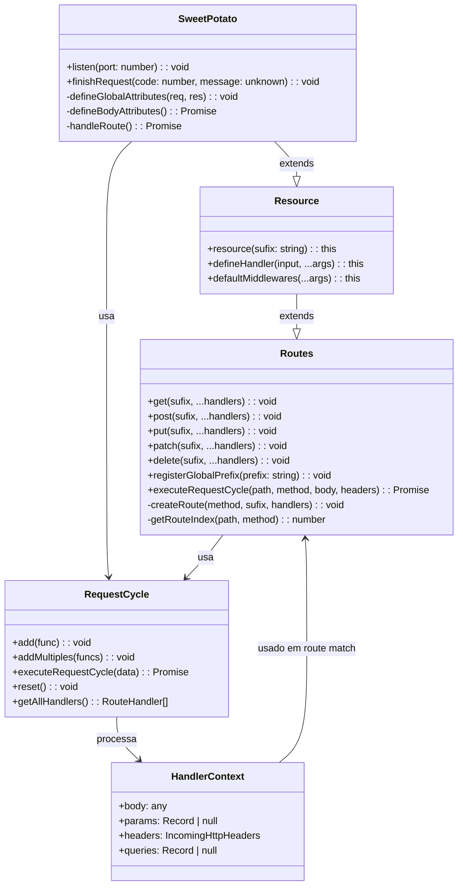
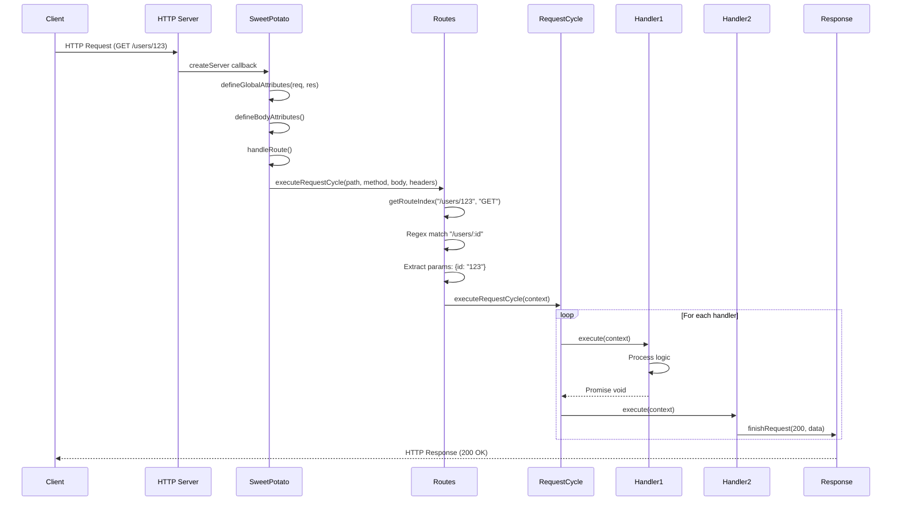

# Arquitetura do Potato Framework

## Visão Geral da Arquitetura

A Potato Framework segue um padrão de **camadas encadeadas** onde cada classe tem responsabilidades bem definidas e cooperam para processar requisições HTTP.

### Diagrama de Classes



## Componentes Detalhados

### 1. SweetPotato (Camada de Infraestrutura)

**Responsabilidade**: Servidor HTTP e ciclo de vida da requisição

```typescript
export class SweetPotato extends Resource {
  private appReq: IncomingMessage | null = null;
  private appRes: ServerResponse | null = null;
  private method: string = '';
  private path: string = '';
  private dataBody: unknown = null;
  private port: number = DEFAULT_PORT;
  private headers: IncomingMessage['headers'] = {};
  private appName = 'App';
}
```

**Métodos Principais**:

| Método | Descrição |
|--------|-----------|
| `listen(port)` | Inicia o servidor HTTP |
| `finishRequest(code, message)` | Envia resposta HTTP |
| `defineGlobalAttributes(req, res)` | Captura dados globais da requisição |
| `defineBodyAttributes()` | Lê e parseia o body da requisição |
| `handleRoute()` | Encaminha para o processo de roteamento |

**Fluxo de Execução no listen()**:

```javascript
http.createServer(async (req, res) => {
  // 1. Captura dados globais
  this.defineGlobalAttributes(req, res);
  
  // 2. Lê e parseia body
  await this.defineBodyAttributes();
  
  // 3. Encontra e executa rota
  await this.handleRoute();
  
  // 4. Finaliza se ainda não terminou
  if (!this.appRes!.writableEnded) {
    this.appRes!.end();
  }
});
```

---

### 2. Routes (Camada de Roteamento)

**Responsabilidade**: Armazenar rotas e realizar match

```typescript
interface Route {
  method: string;                    // GET, POST, PUT, etc.
  originalSufix: string;            // Caminho original (ex: "/users/:id")
  sufix: RegExp;                    // Regex compilada para match
  params: Record<string, string> | null;  // Parâmetros extraídos
  queries: Record<string, string> | null; // Query parameters
  requestCycle: RequestCycle;       // Handlers associados
}
```

**Métodos Principais**:

| Método | Descrição |
|--------|-----------|
| `get/post/put/patch/delete(sufix, ...handlers)` | Registra rotas |
| `registerGlobalPrefix(prefix)` | Define prefixo global (ex: "/api/v1") |
| `executeRequestCycle(path, method, body, headers)` | Executa handlers da rota encontrada |
| `getRouteIndex(path, method)` | Busca índice da rota correspondente |
| `createRoute(method, sufix, handlers)` | Cria nova rota |

**Lógica de Match**:

```typescript
private getRouteIndex(path: string, method: string): number {
  return this.routes.findIndex((e) => {
    // 1. Tenta executar regex da rota no path
    const regexVerifier = e.sufix.exec(path);
    if (!regexVerifier) return false;
    
    // 2. Verifica se método coincide
    if (e.method !== method) return false;
    
    // 3. Verifica se o path combina
    if (regexVerifier.find((t) => t === path)) {
      // 4. Extrai parâmetros e queries
      e.params = getRouteParams(regexVerifier.groups);
      e.queries = getQueries(regexVerifier.groups?.['query']);
      return true;
    }
    return false;
  });
}
```

---

### 3. Resource (Camada de DSL)

**Responsabilidade**: Fluent API para definição de recursos

```typescript
export class Resource extends Routes {
  private sufix: string = '';
  private _defaultMiddlewares: RouteHandler[] = [];
}
```

**Métodos Principais**:

| Método | Descrição |
|--------|-----------|
| `resource(sufix)` | Define o sufixo base para definição de handlers |
| `defineHandler(input, ...args)` | Define um handler para um método HTTP |
| `defaultMiddlewares(...args)` | Adiciona middlewares padrão para todos os handlers do recurso |

**Uso do Resource DSL**:

```typescript
app.resource("message")
  .defineHandler({ method: HttpMethod.GET, sufix: ":id" }, handler)
  .defineHandler({ method: HttpMethod.GET }, handler)
  .defineHandler({ method: HttpMethod.POST }, handler);
```

**Expansão**:
- `message/:id` (GET) → `/message/:id`
- `message` (GET) → `/message`
- `message` (POST) → `/message`

---

### 4. RequestCycle (Camada de Execução)

**Responsabilidade**: Executar handlers em sequência

```typescript
export class RequestCycle {
  private handlers: RouteHandler[];
  
  constructor(handlers?: RouteHandler[]) {
    this.handlers = handlers ?? [];
  }
}
```

**Métodos Principais**:

| Método | Descrição |
|--------|-----------|
| `add(func)` | Adiciona handler individualmente |
| `addMultiples(funcs)` | Adiciona múltiplos handlers |
| `executeRequestCycle(data)` | Executa todos os handlers em sequência |
| `reset()` | Reseta handlers |
| `getAllHandlers()` | Retorna todos os handlers |

**Lógica de Execução com Detecção Async**:

```typescript
async executeRequestCycle(data: HandlerContext): Promise<void> {
  for (let i = 0; i < this.handlers.length; i++) {
    const actualHandler = this.handlers[i];
    
    // Detecta se é async usando constructor.name ou instanceof
    if (!isPromise(actualHandler)) {
      actualHandler(data);  // Sync
    } else {
      await actualHandler(data);  // Async
    }
  }
}
```

---

## Fluxo Completo de uma Requisição

### Diagrama de Sequência



### Passo a Passo

1. **SweetPotato.receive()**
   - Recebe requisição HTTP nativa
   - Chama `defineGlobalAttributes()` para capturar:
     - `req` (IncomingMessage)
     - `res` (ServerResponse)
     - `method` (GET, POST, etc.)
     - `url` (path + query string)
     - `headers`

2. **SweetPotato.defineBodyAttributes()**
   - Lê chunks do body via `for await (const chunk of req)`
   -Concatena buffers
   - Parseia JSON com `JSON.parse()`
   - Armazena em `dataBody`

3. **SweetPotato.handleRoute()**
   - Chama `executeRequestCycle()` do Routes
   - Trata exceptions (404, 500)

4. **Routes.executeRequestCycle()**
   - Chama `getRouteIndex()` para encontrar rota correspondente
   - Cria `HandlerContext` com:
     - body (do SweetPotato)
     - params (extraídos do regex)
     - headers (do SweetPotato)
     - queries (extraídos do querystring)
   - Executa `RequestCycle.execute()`

5. **RequestCycle.execute()**
   - Itera sobre handlers
   - Detecta async via `isPromise()`
   - Chama sync ou await async

6. **finishRequest()**
   - Escreve `res.writeHead(statusCode)`
   - Escreve `res.write(JSON.stringify(data))`
   - Chama `res.end()`

---

## Cores e Logs

O framework usa códigos ANSI para colorir logs no terminal:

```typescript
export const colours: Colours = {
  reset: '\x1b[0m',
  fg: {
    green: '\x1b[32m',  // Logs de info
    yellow: '\x1b[33m', // Nomes de classes
    gray: '\x1b[90m',   // Timestamps
  }
};
```

**Padrão de Log**:
```
[Sweet-Potato] - 2026-04-04T19:02:00.000Z - [RouteHandler] Mapped {/users/:id, GET}
[Sweet-Potato] - 2026-04-04T19:02:00.000Z - [SweetPotato] 3 routes created
[Sweet-Potato] - 2026-04-04T19:02:00.000Z - [SweetPotato] App is running on port 8000
```

---

## Padrões de Projeto Utilizados

| Padrão | Uso no Framework |
|--------|-----------------|
| **Singleton** | `SweetPotatoApp()` - garantia de única instância |
| **Chain of Responsibility** | `RequestCycle` - handlers em sequência |
| **Strategy** | `Routes` - diferentes estratégias de match |
| **Template Method** | `SweetPotato` - define骨架, subclasses implementam |
| **Fluent Interface** | `Resource` - chainable API |

---

## Resumo de Responsabilidades

| Classe | Responsabilidade Única |
|--------|-----------------------|
| **SweetPotato** | Servidor HTTP e ciclo de vida da requisição |
| **Routes** | Armazenamento e match de rotas |
| **Resource** | Fluent API para definição de rotas |
| **RequestCycle** | Execução sequencial de handlers |
| **Utils** | Funções helper (regex, params, logging) |

Cada classe tem **uma única responsabilidade**, seguindo o princípio SRP (Single Responsibility Principle).
