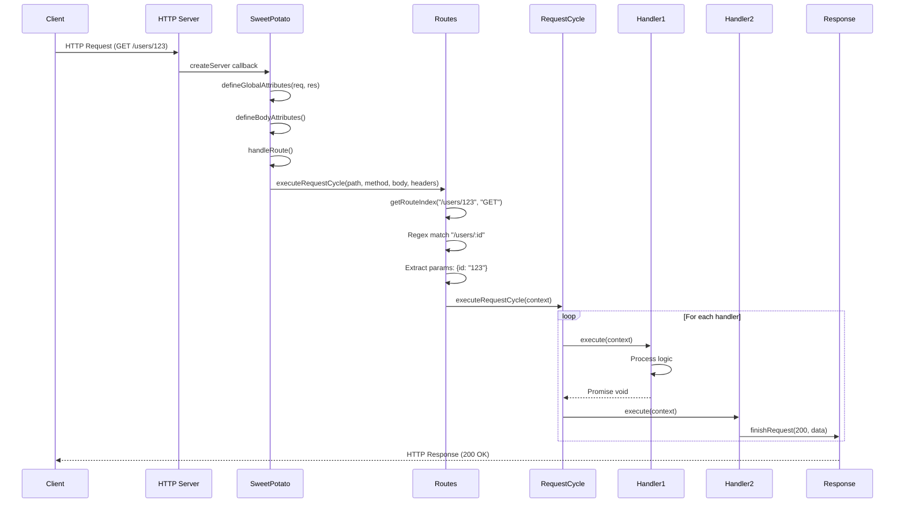

# Potato Framework Architecture

## Architecture Overview

Potato Framework follows a **layered pattern** where each class has well-defined responsibilities and cooperates to process HTTP requests.

### Class Diagram


## Detailed Components

### 1. SweetPotato (Infrastructure Layer)

**Responsibility**: HTTP server and request lifecycle

```typescript
export class SweetPotato extends Resource {
  private appReq: IncomingMessage | null = null;
  private appRes: ServerResponse | null = null;
  private method: string = '';
  private path: string = '';
  private dataBody: unknown = null;
  private port: number = DEFAULT_PORT;
  private headers: IncomingMessage['headers'] = {};
  private appName = 'App';
}
```

**Main Methods**:

| Method | Description |
|--------|-----------|
| `listen(port)` | Starts HTTP server |
| `finishRequest(code, message)` | Sends HTTP response |
| `defineGlobalAttributes(req, res)` | Captures global request data |
| `defineBodyAttributes()` | Reads and parses request body |
| `handleRoute()` | Forwards to routing process |

**Execution Flow in listen()**:

```javascript
http.createServer(async (req, res) => {
  // 1. Capture global data
  this.defineGlobalAttributes(req, res);
  
  // 2. Read and parse body
  await this.defineBodyAttributes();
  
  // 3. Find and execute route
  await this.handleRoute();
  
  // 4. Finalize if not ended
  if (!this.appRes!.writableEnded) {
    this.appRes!.end();
  }
});
```

---

### 2. Routes (Routing Layer)

**Responsibility**: Store routes and perform matching

```typescript
interface Route {
  method: string;                    // GET, POST, PUT, etc.
  originalSufix: string;            // Original path (ex: "/users/:id")
  sufix: RegExp;                    // Compiled regex for matching
  params: Record<string, string> | null;  // Extracted parameters
  queries: Record<string, string> | null; // Query parameters
  requestCycle: RequestCycle;       // Associated handlers
}
```

**Main Methods**:

| Method | Description |
|--------|-----------|
| `get/post/put/patch/delete(sufix, ...handlers)` | Register routes |
| `registerGlobalPrefix(prefix)` | Set global prefix (ex: "/api/v1") |
| `executeRequestCycle(path, method, body, headers)` | Execute handlers of found route |
| `getRouteIndex(path, method)` | Find index of matching route |
| `createRoute(method, sufix, handlers)` | Create new route |

**Matching Logic**:

```typescript
private getRouteIndex(path: string, method: string): number {
  return this.routes.findIndex((e) => {
    // 1. Try executing route regex on path
    const regexVerifier = e.sufix.exec(path);
    if (!regexVerifier) return false;
    
    // 2. Check if method matches
    if (e.method !== method) return false;
    
    // 3. Check if path matches
    if (regexVerifier.find((t) => t === path)) {
      // 4. Extract parameters and queries
      e.params = getRouteParams(regexVerifier.groups);
      e.queries = getQueries(regexVerifier.groups?.['query']);
      return true;
    }
    return false;
  });
}
```

---

### 3. Resource (DSL Layer)

**Responsibility**: Fluent API for resource definition

```typescript
export class Resource extends Routes {
  private sufix: string = '';
  private _defaultMiddlewares: RouteHandler[] = [];
}
```

**Main Methods**:

| Method | Description |
|--------|-----------|
| `resource(sufix)` | Defines base suffix for handler definition |
| `defineHandler(input, ...args)` | Defines handler for an HTTP method |
| `defaultMiddlewares(...args)` | Adds default middlewares for all resource handlers |

**Resource DSL Usage**:

```typescript
app.resource("message")
  .defineHandler({ method: HttpMethod.GET, sufix: ":id" }, handler)
  .defineHandler({ method: HttpMethod.GET }, handler)
  .defineHandler({ method: HttpMethod.POST }, handler);
```

**Expansion**:
- `message/:id` (GET) → `/message/:id`
- `message` (GET) → `/message`
- `message` (POST) → `/message`

---

### 4. RequestCycle (Execution Layer)

**Responsibility**: Execute handlers in sequence

```typescript
export class RequestCycle {
  private handlers: RouteHandler[];
  
  constructor(handlers?: RouteHandler[]) {
    this.handlers = handlers ?? [];
  }
}
```

**Main Methods**:

| Method | Description |
|--------|-----------|
| `add(func)` | Add handler individually |
| `addMultiples(funcs)` | Add multiple handlers |
| `executeRequestCycle(data)` | Execute all handlers in sequence |
| `reset()` | Reset handlers |
| `getAllHandlers()` | Return all handlers |

**Execution Logic with Async Detection**:

```typescript
async executeRequestCycle(data: HandlerContext): Promise<void> {
  for (let i = 0; i < this.handlers.length; i++) {
    const actualHandler = this.handlers[i];
    
    // Detect if it's async using constructor.name or instanceof
    if (!isPromise(actualHandler)) {
      actualHandler(data);  // Sync
    } else {
      await actualHandler(data);  // Async
    }
  }
}
```

---

## Complete Request Flow

### Sequence Diagram



### Step by Step

1. **SweetPotato.receive()**
   - Receives native HTTP request
   - Calls `defineGlobalAttributes()` to capture:
     - `req` (IncomingMessage)
     - `res` (ServerResponse)
     - `method` (GET, POST, etc.)
     - `url` (path + query string)
     - `headers`

2. **SweetPotato.defineBodyAttributes()**
   - Reads body chunks via `for await (const chunk of req)`
   - Concatenates buffers
   - Parses JSON with `JSON.parse()`
   - Stores in `dataBody`

3. **SweetPotato.handleRoute()**
   - Calls `executeRequestCycle()` from Routes
   - Handles exceptions (404, 500)

4. **Routes.executeRequestCycle()**
   - Calls `getRouteIndex()` to find matching route
   - Creates `HandlerContext` with:
     - body (from SweetPotato)
     - params (extracted from regex)
     - headers (from SweetPotato)
     - queries (extracted from querystring)
   - Executes `RequestCycle.execute()`

5. **RequestCycle.execute()**
   - Iterates over handlers
   - Detects async via `isPromise()`
   - Calls sync or await async

6. **finishRequest()**
   - Writes `res.writeHead(statusCode)`
   - Writes `res.write(JSON.stringify(data))`
   - Calls `res.end()`

---

## Colors and Logs

The framework uses ANSI codes to color logs in the terminal:

```typescript
export const colours: Colours = {
  reset: '\x1b[0m',
  fg: {
    green: '\x1b[32m',  // Info logs
    yellow: '\x1b[33m', // Class names
    gray: '\x1b[90m',   // Timestamps
  }
};
```

**Log Pattern**:
```
[Sweet-Potato] - 2026-04-04T19:02:00.000Z - [RouteHandler] Mapped {/users/:id, GET}
[Sweet-Potato] - 2026-04-04T19:02:00.000Z - [SweetPotato] 3 routes created
[Sweet-Potato] - 2026-04-04T19:02:00.000Z - [SweetPotato] App is running on port 8000
```

---

## Design Patterns Used

| Pattern | Usage in Framework |
|--------|-----------------|
| **Singleton** | `SweetPotatoApp()` - ensures single instance |
| **Chain of Responsibility** | `RequestCycle` - handlers in sequence |
| **Strategy** | `Routes` - different match strategies |
| **Template Method** | `SweetPotato` - defines skeleton, subclasses implement |
| **Fluent Interface** | `Resource` - chainable API |

---

## Responsibility Summary

| Class | Unique Responsibility |
|--------|-----------------------|
| **SweetPotato** | HTTP server and request lifecycle |
| **Routes** | Route storage and matching |
| **Resource** | Fluent API for route definition |
| **RequestCycle** | Sequential handler execution |
| **Utils** | Helper functions (regex, params, logging) |

Each class has **single responsibility**, following the SRP (Single Responsibility Principle).