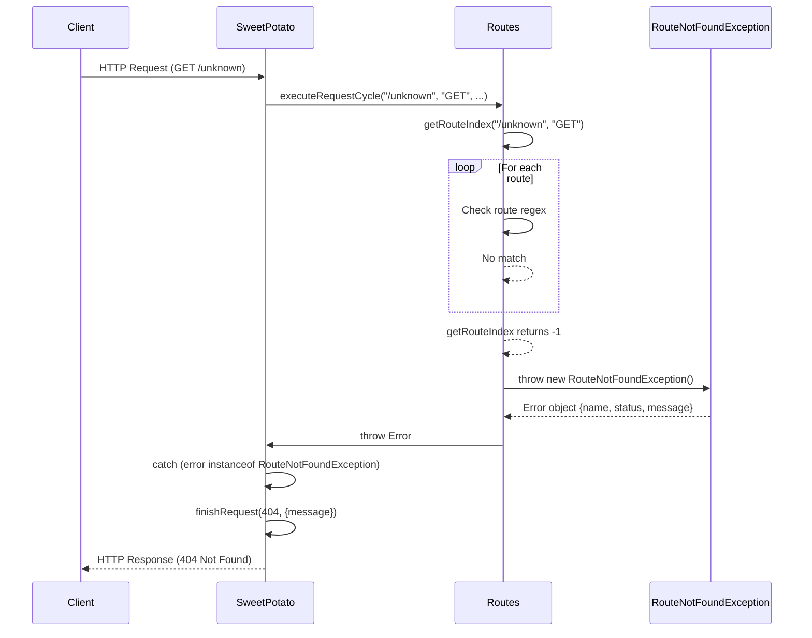

# RouteNotFoundException - Erro de Rota Não Encontrada

## Visão Geral

`RouteNotFoundException` é a classe de erro customizada que é lançada quando **nenhuma rota corresponde ao path e método HTTP** de uma requisição.

```typescript
import { CONSTANTS_ROUTES } from "../constants/routes.constants.js";

export class RouteNotFoundException extends Error {
  status: number = 404;

  constructor() {
    super(CONSTANTS_ROUTES.INVALID_ROUTE_MESSAGE);
    this.name = "RouteNotFoundException";
    
    const ErrorWithCapture = Error as typeof Error & {
      captureStackTrace?: (target: object, constructor: Function) => void;
    };
    if (ErrorWithCapture.captureStackTrace) {
      ErrorWithCapture.captureStackTrace(this, this.constructor);
    }
  }
}
```

## Estrutura da Classe

### Atributos

| Atributo | Tipo | Valor | Descrição |
|----------|------|-------|-----------|
| `name` | `string` | `"RouteNotFoundException"` | Nome do erro |
| `status` | `number` | `404` | Status HTTP correspondente |
| `message` | `string` | `"Route not founded!"` | Mensagem de erro |

### Mensagem de Erro

```typescript
// constants/routes.constants.ts
export const CONSTANTS_ROUTES: { readonly INVALID_ROUTE_MESSAGE: string } = {
  INVALID_ROUTE_MESSAGE: "Route not founded!",
};
```

**Nota**: A mensagem tem um typo intencional (`founded` em vez de `found`). Mantido para consistência.

## Quando É Lançado

### Em Routes.getRouteIndex()

```typescript
// Routes.ts
private getRouteIndex(path: string, method: string): number {
  return this.routes.findIndex((e) => {
    const regexVerifier = e.sufix.exec(path);
    if (!regexVerifier) return false;
    if (e.method !== method) return false;
    if (regexVerifier.find((t) => t === path)) {
      e.params = getRouteParams(regexVerifier.groups as Record<string, string>);
      e.queries = getQueries(regexVerifier.groups?.['query']);
      return true;
    }
    return false;
  });
}
```

### Em Routes.executeRequestCycle()

```typescript
// Routes.ts
async executeRequestCycle(
  path: string,
  method: string,
  body: unknown,
  headers: IncomingHttpHeaders
): Promise<void> {
  const routeIndex = this.getRouteIndex(path, method);
  
  if (routeIndex < 0) {
    throw new RouteNotFoundException();  // ← Lançado aqui
  }
  
  const route = this.routes[routeIndex];
  // ...
}
```

**Condição para lançamento**:
- `getRouteIndex()` retorna `-1` (não encontrou rota)
- Ou seja: nenhuma rota no array `this.routes` corresponde ao path + method

## Fluxo Completo do Erro

### Sequência de Lançamento e Tratamento



### Diagrama de Código

```typescript
// 1. Routes.executeRequestCycle
async executeRequestCycle(...): Promise<void> {
  const routeIndex = this.getRouteIndex(path, method);
  if (routeIndex < 0) {
    throw new RouteNotFoundException();  // ← Lança aqui
  }
  // ...
}

// 2. SweetPotato.handleRoute
private async handleRoute(): Promise<void> {
  try {
    return await this.executeRequestCycle(...);
  } catch (error) {
    // 3. Tratamento do erro
    if (error instanceof RouteNotFoundException) {
      return this.finishRequest(HttpStatusCode.NOT_FOUND, {  // 404
        message: (error as Error).message,
      });
    }
    // Outros erros → 500
    return this.finishRequest(HttpStatusCode.INTERNAL_SERVER_ERROR, {
      message: (error as Error).message,
    });
  }
}
```

## Exemplos de Ocorrência

### Exemplo 1: Path Não Registrado

```typescript
import { SweetPotatoApp } from '../SweetPotatoApp.mjs';

const app = SweetPotatoApp();

// Registra apenas /users
app.get('/users', (ctx) => {
  app.finishRequest(200, { users: [] });
});

// Acessa /posts que não foi registrado
app.listen(8000);

// Request: GET /posts
// Result: 404 RouteNotFoundException
```

### Exemplo 2: Method Incorreto

```typescript
import { SweetPotatoApp } from '../SweetPotatoApp.mjs';

const app = SweetPotatoApp();

// Registra GET /users
app.get('/users', (ctx) => {
  app.finishRequest(200, { users: [] });
});

// Request: POST /users (método não registrado)
// Result: 404 RouteNotFoundException
```

### Exemplo 3: Path com Parameter Incorreto

```typescript
import { SweetPotatoApp } from '../SweetPotatoApp.mjs';

const app = SweetPotatoApp();

// Registra /users/:id
app.get('/users/:id', (ctx) => {
  app.finishRequest(200, { id: ctx.params?.id });
});

// Request: /posts (path não registrado)
// Result: 404 RouteNotFoundException

// Request: /users (falta :id no path)
// Result: 404 RouteNotFoundException (regex não match)
```

## Propriedades do Erro

### name: "RouteNotFoundException"

```typescript
const error = new RouteNotFoundException();
console.log(error.name);  // "RouteNotFoundException"
```

### status: 404

```typescript
const error = new RouteNotFoundException();
console.log(error.status);  // 404
```

**Uso no framework**:
```typescript
// Em SweetPotato, não é usado diretamente
// O status é passado para finishRequest como HttpStatusCode.NOT_FOUND (404)
```

### message: "Route not founded!"

```typescript
const error = new RouteNotFoundException();
console.log(error.message);  // "Route not founded!"
```

**Uso no framework**:
```typescript
// Em SweetPotato.handleRoute()
if (error instanceof RouteNotFoundException) {
  return this.finishRequest(HttpStatusCode.NOT_FOUND, {
    message: (error as Error).message,  // "Route not founded!"
  });
}
```

## Stack Trace

### captureStackTrace

```typescript
const ErrorWithCapture = Error as typeof Error & {
  captureStackTrace?: (target: object, constructor: Function) => void;
};
if (ErrorWithCapture.captureStackTrace) {
  ErrorWithCapture.captureStackTrace(this, this.constructor);
}
```

**Propósito**: Remove o stack trace dos frames internos do framework, mostrando apenas o código do usuário.

### Com captureStackTrace

```
Error: Route not founded!
    at Routes.executeRequestCycle (Routes.ts:103)
    at SweetPotato.handleRoute (SweetPotato.ts:64)
    at Server.<anonymous> (SweetPotato.ts:28)
    at Server.emit (node:events)
    ...
```

### Sem captureStackTrace (comportamento padrão do Node.js)

O Node.js por padrão inclui todos os frames no stack trace, incluindo chamadas internas do framework.

## Comparação com Outros Frameworks

### Express.js

```javascript
// Express
app.get('/users', handler);

// Request: GET /unknown
// Response: 404 "Cannot GET /unknown"

// Express usa uma abordagem diferente:
// Se não encontra rota, chama next() com um Error
```

### Fastify

```javascript
// Fastify
app.get('/users', handler);

// Request: GET /unknown
// Response: 404 { error: "Not Found", message: "Cannot GET /unknown" }

// Fastify tem um handler 404 interno
```

### Potato Framework

```typescript
// Potato
app.get('/users', handler);

// Request: GET /unknown
// Response: 404 { message: "Route not founded!" }

// Potato lança RouteNotFoundException e captura em SweetPotato
```

## Type Checking no Framework

### instanceof Check

```typescript
if (error instanceof RouteNotFoundException) {
  // Trata como 404
  return this.finishRequest(HttpStatusCode.NOT_FOUND, { ... });
}
```

**Por que `instanceof`**:
- Diferencia de outros erros
- Permite tratamento específico
- Mantém encapsulamento de lógica

### Error Type Checking Alternatives

**Alternativa 1: Check por name**
```typescript
if (error.name === 'RouteNotFoundException') {
  // ...
}
```
**Problema**: Nome pode mudar, menos seguro

**Alternativa 2: Check por message**
```typescript
if (error.message === 'Route not founded!') {
  // ...
}
```
**Problema**: Mensagem pode mudar, menos seguro

**Alternativa 3: Symbol ou tag**
```typescript
const RouteNotFoundExceptionTag = Symbol('RouteNotFoundException');
if (error[RouteNotFoundExceptionTag]) {
  // ...
}
```
**Problema**: Mais complexo, não necessário

**Conclusão**: `instanceof` é a melhor abordagem.

## Customização do Erro

### Extensão da Classe

```typescript
import { RouteNotFoundException } from './package/index.mjs';

class CustomRouteNotFoundException extends RouteNotFoundException {
  constructor(public path: string, public method: string) {
    super(`Route ${method} ${path} not found`);
    this.name = 'CustomRouteNotFoundException';
  }
}

// Em Routes
if (routeIndex < 0) {
  throw new CustomRouteNotFoundException(path, method);
}
```

**Nota**: Isso quebraria o `instanceof RouteNotFoundException` check em SweetPotato.

### Solução: Uso do Type Guard

```typescript
function isRouteNotFoundException(error: Error): error is RouteNotFoundException {
  return error.name === 'RouteNotFoundException';
}

// Em SweetPotato
if (isRouteNotFoundException(error)) {
  // Trata como 404
}
```

## Testes de Unitário

### Testar Exception

```typescript
// routes.test.ts
import { Routes } from './Routes.mjs';
import { RouteNotFoundException } from './RouteNotFoundException.mjs';

describe('Routes', () => {
  it('should throw RouteNotFoundException for unmatched route', () => {
    const routes = new Routes();
    
    expect(() => {
      routes.executeRequestCycle('/unknown', 'GET', null, {});
    }).toThrow(RouteNotFoundException);
  });
  
  it('should have correct status', () => {
    const error = new RouteNotFoundException();
    expect(error.status).toBe(404);
  });
  
  it('should have correct message', () => {
    const error = new RouteNotFoundException();
    expect(error.message).toBe('Route not founded!');
  });
});
```

### Testar Integração com SweetPotato

```typescript
// sweetpotato.test.ts
import { SweetPotato } from './SweetPotato.mjs';
import { HttpStatusCode } from './constants/index.mjs';

describe('SweetPotato', () => {
  it('should return 404 for unknown route', async () => {
    const app = new SweetPotato();
    let responseCode: number | null = null;
    let responseBody: string | null = null;
    
    // Mock finishRequest
    app.finishRequest = (code, message) => {
      responseCode = code;
      responseBody = JSON.stringify(message);
    };
    
    // Mock route not found
    app.executeRequestCycle = async () => {
      throw new RouteNotFoundException();
    };
    
    await app.handleRoute();
    
    expect(responseCode).toBe(HttpStatusCode.NOT_FOUND);
    expect(responseBody).toContain('Route not founded!');
  });
});
```

## Performance Considerations

### Overhead de Criação

```typescript
// Criação do erro
new RouteNotFoundException();

// Opcional: captureStackTrace
const ErrorWithCapture = Error as typeof Error & {
  captureStackTrace?: (target: object, constructor: Function) => void;
};
if (ErrorWithCapture.captureStackTrace) {
  ErrorWithCapture.captureStackTrace(this, this.constructor);
}
```

**Impacto**:
- Criação de objeto Error: O(1)
- `captureStackTrace`: O(n) onde n = tamanho do stack trace (aproximado)

### Otimização

Se performance for crítica, pode-se evitar `captureStackTrace`:

```typescript
export class RouteNotFoundException extends Error {
  status: number = 404;

  constructor() {
    super(CONSTANTS_ROUTES.INVALID_ROUTE_MESSAGE);
    this.name = "RouteNotFoundException";
    // remove captureStackTrace para performance
  }
}
```

**Trade-off**:
- **Com**: Stack trace limpo (mostra código do usuário)
- **Sem**: Stack trace mais detalhado (mostra chamadas do framework)

## Resumo

| Aspecto | Implementação |
|---------|---------------|
| **Tipo** | Class extensão de `Error` |
| **name** | `"RouteNotFoundException"` |
| **status** | `404` |
| **message** | `"Route not founded!"` |
| **Lançado em** | `Routes.executeRequestCycle()` |
| **Tratado em** | `SweetPotato.handleRoute()` |
| **Response** | `404 Not Found` |

### Propriedades do Erro

| Propriedade | Valor | Uso |
|-------------|-------|-----|
| `name` | `"RouteNotFoundException"` | Type check |
| `status` | `404` | Status HTTP |
| `message` | `"Route not founded!"` | Mensagem de erro |
| `stack` | Stack trace | Debug |

### Fluxo Completo

```
Routes.executeRequestCycle()
  ↓
getRouteIndex() returns -1
  ↓
throw new RouteNotFoundException()
  ↓
SweetPotato.handleRoute() catch
  ↓
error instanceof RouteNotFoundException
  ↓
finishRequest(HttpStatusCode.NOT_FOUND, { message })
  ↓
HTTP Response (404)
```

### Vantagens

1. **Type Safety**: `instanceof` check é seguro
2. **Encapsulamento**: Lógica de tratamento está em um lugar
3. **Mensagens**: Mensagem customizada para usuário
4. **Consistência**: Todos os erros 404 são tratados igualmente

### Limitações

1. **Não estensível**: `instanceof` check pode quebrar com extensão
2. **Typo na mensagem**: "Route not founded!" (intencional ou não)
3. **Sem dados contextuais**: Não inclui path/method no erro

### Possíveis Melhorias

```typescript
export class RouteNotFoundException extends Error {
  status: number = 404;
  
  constructor(
    public path: string,
    public method: string
  ) {
    super(`Route ${method} ${path} not founded!`);
    this.name = "RouteNotFoundException";
  }
}

// Em Routes
throw new RouteNotFoundException(path, method);

// Em SweetPotato
if (error instanceof RouteNotFoundException) {
  return this.finishRequest(HttpStatusCode.NOT_FOUND, {
    message: error.message,
    path: error.path,    // Dados adicionais
    method: error.method,
  });
}
```
