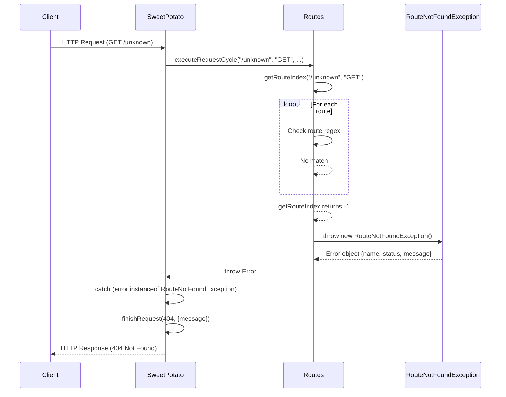

# RouteNotFoundException - Route Not Found Error

## Overview

`RouteNotFoundException` is the custom error class that is thrown when **no route matches the path and HTTP method** of a request.

```typescript
import { CONSTANTS_ROUTES } from "../constants/routes.constants.js";

export class RouteNotFoundException extends Error {
  status: number = 404;

  constructor() {
    super(CONSTANTS_ROUTES.INVALID_ROUTE_MESSAGE);
    this.name = "RouteNotFoundException";
    
    const ErrorWithCapture = Error as typeof Error & {
      captureStackTrace?: (target: object, constructor: Function) => void;
    };
    if (ErrorWithCapture.captureStackTrace) {
      ErrorWithCapture.captureStackTrace(this, this.constructor);
    }
  }
}
```

## Class Structure

### Attributes

| Attribute | Type | Value | Description |
|----------|------|-------|-----------|
| `name` | `string` | `"RouteNotFoundException"` | Error name |
| `status` | `number` | `404` | Corresponding HTTP status |
| `message` | `string` | `"Route not founded!"` | Error message |

### Error Message

```typescript
// constants/routes.constants.ts
export const CONSTANTS_ROUTES: { readonly INVALID_ROUTE_MESSAGE: string } = {
  INVALID_ROUTE_MESSAGE: "Route not founded!",
};
```

**Note**: The message has an intentional typo (`founded` instead of `found`). Kept for consistency.

## When It's Thrown

### In Routes.getRouteIndex()

```typescript
// Routes.ts
private getRouteIndex(path: string, method: string): number {
  return this.routes.findIndex((e) => {
    const regexVerifier = e.sufix.exec(path);
    if (!regexVerifier) return false;
    if (e.method !== method) return false;
    if (regexVerifier.find((t) => t === path)) {
      e.params = getRouteParams(regexVerifier.groups as Record<string, string>);
      e.queries = getQueries(regexVerifier.groups?.['query']);
      return true;
    }
    return false;
  });
}
```

### In Routes.executeRequestCycle()

```typescript
// Routes.ts
async executeRequestCycle(
  path: string,
  method: string,
  body: unknown,
  headers: IncomingHttpHeaders
): Promise<void> {
  const routeIndex = this.getRouteIndex(path, method);
  
  if (routeIndex < 0) {
    throw new RouteNotFoundException();  // ← Thrown here
  }
  
  const route = this.routes[routeIndex];
  // ...
}
```

**Condition for throwing**:
- `getRouteIndex()` returns `-1` (no route found)
- That is: no route in the `this.routes` array matches path + method

## Complete Error Flow

### Throw and Handling Sequence



### Code Diagram

```typescript
// 1. Routes.executeRequestCycle
async executeRequestCycle(...): Promise<void> {
  const routeIndex = this.getRouteIndex(path, method);
  if (routeIndex < 0) {
    throw new RouteNotFoundException();  // ← Throw here
  }
  // ...
}

// 2. SweetPotato.handleRoute
private async handleRoute(): Promise<void> {
  try {
    return await this.executeRequestCycle(...);
  } catch (error) {
    // 3. Error handling
    if (error instanceof RouteNotFoundException) {
      return this.finishRequest(HttpStatusCode.NOT_FOUND, {  // 404
        message: (error as Error).message,
      });
    }
    // Other errors → 500
    return this.finishRequest(HttpStatusCode.INTERNAL_SERVER_ERROR, {
      message: (error as Error).message,
    });
  }
}
```

## Occurrence Examples

### Example 1: Unregistered Path

```typescript
import { SweetPotatoApp } from '../SweetPotatoApp.mjs';

const app = SweetPotatoApp();

// Register only /users
app.get('/users', (ctx) => {
  app.finishRequest(200, { users: [] });
});

// Access /posts which was not registered
app.listen(8000);

// Request: GET /posts
// Result: 404 RouteNotFoundException
```

### Example 2: Incorrect Method

```typescript
import { SweetPotatoApp } from '../SweetPotatoApp.mjs';

const app = SweetPotatoApp();

// Register GET /users
app.get('/users', (ctx) => {
  app.finishRequest(200, { users: [] });
});

// Request: POST /users (method not registered)
// Result: 404 RouteNotFoundException
```

### Example 3: Path with Incorrect Parameter

```typescript
import { SweetPotatoApp } from '../SweetPotatoApp.mjs';

const app = SweetPotatoApp();

// Register /users/:id
app.get('/users/:id', (ctx) => {
  app.finishRequest(200, { id: ctx.params?.id });
});

// Request: /posts (unregistered path)
// Result: 404 RouteNotFoundException

// Request: /users (missing :id in path)
// Result: 404 RouteNotFoundException (regex doesn't match)
```

## Error Properties

### name: "RouteNotFoundException"

```typescript
const error = new RouteNotFoundException();
console.log(error.name);  // "RouteNotFoundException"
```

### status: 404

```typescript
const error = new RouteNotFoundException();
console.log(error.status);  // 404
```

**Usage in framework**:
```typescript
// In SweetPotato, not used directly
// The status is passed to finishRequest as HttpStatusCode.NOT_FOUND (404)
```

### message: "Route not founded!"

```typescript
const error = new RouteNotFoundException();
console.log(error.message);  // "Route not founded!"
```

**Usage in framework**:
```typescript
// In SweetPotato.handleRoute()
if (error instanceof RouteNotFoundException) {
  return this.finishRequest(HttpStatusCode.NOT_FOUND, {
    message: (error as Error).message,  // "Route not founded!"
  });
}
```

## Stack Trace

### captureStackTrace

```typescript
const ErrorWithCapture = Error as typeof Error & {
  captureStackTrace?: (target: object, constructor: Function) => void;
};
if (ErrorWithCapture.captureStackTrace) {
  ErrorWithCapture.captureStackTrace(this, this.constructor);
}
```

**Purpose**: Removes internal framework frames from stack trace, showing only user code.

### With captureStackTrace

```
Error: Route not founded!
    at Routes.executeRequestCycle (Routes.ts:103)
    at SweetPotato.handleRoute (SweetPotato.ts:64)
    at Server.<anonymous> (SweetPotato.ts:28)
    at Server.emit (node:events)
    ...
```

### Without captureStackTrace (default Node.js behavior)

Node.js by default includes all frames in stack trace, including framework internal calls.

## Comparison with Other Frameworks

### Express.js

```javascript
// Express
app.get('/users', handler);

// Request: GET /unknown
// Response: 404 "Cannot GET /unknown"

// Express uses a different approach:
// If no route found, calls next() with an Error
```

### Fastify

```javascript
// Fastify
app.get('/users', handler);

// Request: GET /unknown
// Response: 404 { error: "Not Found", message: "Cannot GET /unknown" }

// Fastify has an internal 404 handler
```

### Potato Framework

```typescript
// Potato
app.get('/users', handler);

// Request: GET /unknown
// Response: 404 { message: "Route not founded!" }

// Potato throws RouteNotFoundException and catches it in SweetPotato
```

## Type Checking in Framework

### instanceof Check

```typescript
if (error instanceof RouteNotFoundException) {
  // Handle as 404
  return this.finishRequest(HttpStatusCode.NOT_FOUND, { ... });
}
```

**Why `instanceof`**:
- Differentiates from other errors
- Allows specific handling
- Keeps logic encapsulation

### Error Type Checking Alternatives

**Alternative 1: Check by name**
```typescript
if (error.name === 'RouteNotFoundException') {
  // ...
}
```
**Problem**: Name can change, less secure

**Alternative 2: Check by message**
```typescript
if (error.message === 'Route not founded!') {
  // ...
}
```
**Problem**: Message can change, less secure

**Alternative 3: Symbol or tag**
```typescript
const RouteNotFoundExceptionTag = Symbol('RouteNotFoundException');
if (error[RouteNotFoundExceptionTag]) {
  // ...
}
```
**Problem**: More complex, not necessary

**Conclusion**: `instanceof` is the best approach.

## Error Customization

### Extending the Class

```typescript
import { RouteNotFoundException } from './package/index.mjs';

class CustomRouteNotFoundException extends RouteNotFoundException {
  constructor(public path: string, public method: string) {
    super(`Route ${method} ${path} not found`);
    this.name = 'CustomRouteNotFoundException';
  }
}

// In Routes
if (routeIndex < 0) {
  throw new CustomRouteNotFoundException(path, method);
}
```

**Note**: This would break the `instanceof RouteNotFoundException` check in SweetPotato.

### Solution: Using Type Guard

```typescript
function isRouteNotFoundException(error: Error): error is RouteNotFoundException {
  return error.name === 'RouteNotFoundException';
}

// In SweetPotato
if (isRouteNotFoundException(error)) {
  // Handle as 404
}
```

## Unit Tests

### Test Exception

```typescript
// routes.test.ts
import { Routes } from './Routes.mjs';
import { RouteNotFoundException } from './RouteNotFoundException.mjs';

describe('Routes', () => {
  it('should throw RouteNotFoundException for unmatched route', () => {
    const routes = new Routes();
    
    expect(() => {
      routes.executeRequestCycle('/unknown', 'GET', null, {});
    }).toThrow(RouteNotFoundException);
  });
  
  it('should have correct status', () => {
    const error = new RouteNotFoundException();
    expect(error.status).toBe(404);
  });
  
  it('should have correct message', () => {
    const error = new RouteNotFoundException();
    expect(error.message).toBe('Route not founded!');
  });
});
```

### Test Integration with SweetPotato

```typescript
// sweetpotato.test.ts
import { SweetPotato } from './SweetPotato.mjs';
import { HttpStatusCode } from './constants/index.mjs';

describe('SweetPotato', () => {
  it('should return 404 for unknown route', async () => {
    const app = new SweetPotato();
    let responseCode: number | null = null;
    let responseBody: string | null = null;
    
    // Mock finishRequest
    app.finishRequest = (code, message) => {
      responseCode = code;
      responseBody = JSON.stringify(message);
    };
    
    // Mock route not found
    app.executeRequestCycle = async () => {
      throw new RouteNotFoundException();
    };
    
    await app.handleRoute();
    
    expect(responseCode).toBe(HttpStatusCode.NOT_FOUND);
    expect(responseBody).toContain('Route not founded!');
  });
});
```

## Performance Considerations

### Creation Overhead

```typescript
// Error creation
new RouteNotFoundException();

// Optional: captureStackTrace
const ErrorWithCapture = Error as typeof Error & {
  captureStackTrace?: (target: object, constructor: Function) => void;
};
if (ErrorWithCapture.captureStackTrace) {
  ErrorWithCapture.captureStackTrace(this, this.constructor);
}
```

**Impact**:
- Error object creation: O(1)
- `captureStackTrace`: O(n) where n = stack trace size (approximate)

### Optimization

If performance is critical, you can avoid `captureStackTrace`:

```typescript
export class RouteNotFoundException extends Error {
  status: number = 404;

  constructor() {
    super(CONSTANTS_ROUTES.INVALID_ROUTE_MESSAGE);
    this.name = "RouteNotFoundException";
    // remove captureStackTrace for performance
  }
}
```

**Trade-off**:
- **With**: Clean stack trace (shows user code)
- **Without**: More detailed stack trace (shows framework calls)

## Summary

| Aspect | Implementation |
|--------|---------------|
| **Type** | Class extending `Error` |
| **name** | `"RouteNotFoundException"` |
| **status** | `404` |
| **message** | `"Route not founded!"` |
| **Thrown in** | `Routes.executeRequestCycle()` |
| **Handled in** | `SweetPotato.handleRoute()` |
| **Response** | `404 Not Found` |

### Error Properties

| Property | Value | Usage |
|------------|-------|-----|
| `name` | `"RouteNotFoundException"` | Type check |
| `status` | `404` | HTTP status |
| `message` | `"Route not founded!"` | Error message |
| `stack` | Stack trace | Debug |

### Complete Flow

```
Routes.executeRequestCycle()
  ↓
getRouteIndex() returns -1
  ↓
throw new RouteNotFoundException()
  ↓
SweetPotato.handleRoute() catch
  ↓
error instanceof RouteNotFoundException
  ↓
finishRequest(HttpStatusCode.NOT_FOUND, { message })
  ↓
HTTP Response (404)
```

### Advantages

1. **Type Safety**: `instanceof` check is safe
2. **Encapsulation**: Handling logic is in one place
3. **Custom Messages**: Custom message for user
4. **Consistency**: All 404 errors handled equally

### Limitations

1. **Not extensible**: `instanceof` check can break with extension
2. **Typo in message**: "Route not founded!" (intentional or not)
3. **No contextual data**: Doesn't include path/method in error

### Possible Improvements

```typescript
export class RouteNotFoundException extends Error {
  status: number = 404;
  
  constructor(
    public path: string,
    public method: string
  ) {
    super(`Route ${method} ${path} not founded!`);
    this.name = "RouteNotFoundException";
  }
}

// In Routes
throw new RouteNotFoundException(path, method);

// In SweetPotato
if (error instanceof RouteNotFoundException) {
  return this.finishRequest(HttpStatusCode.NOT_FOUND, {
    message: error.message,
    path: error.path,    // Additional data
    method: error.method,
  });
}
```