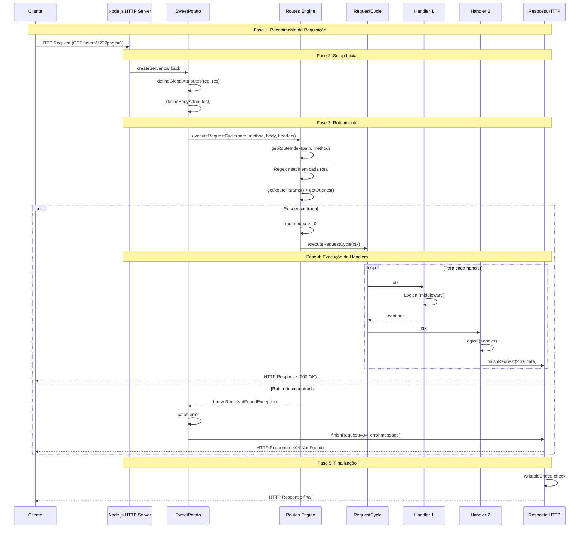

# Ciclo de Vida da Requisição

## Visão Geral

Este documento descreve o **ciclo de vida completo de uma requisição HTTP** dentro do Potato Framework, desde a chegada da requisição até o envio da resposta.

## Diagrama de Fluxo



## Fase 1: Recebimento da Requisição

### Evento HTTP Server

```typescript
// SweetPotato.ts
http
  .createServer(async (req: IncomingMessage, res: ServerResponse) => {
    // Início do ciclo de vida
    this.defineGlobalAttributes(req, res);
    await this.defineBodyAttributes();
    await this.handleRoute();
    
    if (!this.appRes!.writableEnded) {
      this.appRes!.end();
    }
  })
  .listen(this.port, () => {
    log().info(`${this.getRoutes().length} routes created`, this.appName);
    log().info(`App is running on port ${this.port}`, this.appName);
  });
```

### Estado Inicial

No momento do callback:
```typescript
req: IncomingMessage {
  method: "GET",
  url: "/users/123?page=1",
  headers: { host, user-agent, ... },
  // ...
}

res: ServerResponse {
  // ...
}
```

---

## Fase 2: Setup Inicial

### defineGlobalAttributes(req, res)

**Responsabilidade**: Capturar dados globais da requisição

```typescript
private defineGlobalAttributes(req: IncomingMessage, res: ServerResponse): void {
  this.appReq = req;
  this.appRes = res;
  this.method = (req.method ?? 'GET').toUpperCase();   // "GET"
  this.path = req.url ?? '/';                           // "/users/123?page=1"
  this.headers = req.headers;                           // headers object
}
```

**Atributos capturados**:

| Atributo | Fonte | Valor Exemplo |
|----------|-------|----------------|
| `appReq` | `req` | IncomingMessage |
| `appRes` | `res` | ServerResponse |
| `method` | `req.method` | `"GET"` |
| `path` | `req.url` | `"/users/123?page=1"` |
| `headers` | `req.headers` | `{ host: "localhost:8000" }` |

---

### defineBodyAttributes()

**Responsabilidade**: Ler e parsear o body da requisição

```typescript
private async defineBodyAttributes(): Promise<void> {
  const buffers: Buffer[] = [];

  for await (const chunk of this.appReq!) {
    buffers.push(chunk as Buffer);
  }

  if (buffers.length) {
    this.dataBody = JSON.parse(Buffer.concat(buffers).toString());
  }
}
```

**Comportamento**:

1. Loop sobre chunks do body
2. Concatena todos os buffers
3. Parseia JSON
4. Se body vazio: `dataBody = null`

**Limitações**:
- Apenas suporta JSON
- Não há tratamento de erros de parse

---

## Fase 3: Roteamento

### handleRoute()

**Responsabilidade**: Encontrar e executar a rota correspondente

```typescript
private async handleRoute(): Promise<void> {
  try {
    return await this.executeRequestCycle(
      this.path,
      this.method,
      this.dataBody,
      this.headers
    );
  } catch (error) {
    if (error instanceof RouteNotFoundException) {
      return this.finishRequest(HttpStatusCode.NOT_FOUND, {
        message: (error as Error).message,
      });
    }
    return this.finishRequest(HttpStatusCode.INTERNAL_SERVER_ERROR, {
      message: (error as Error).message,
    });
  }
}
```

**Fluxo**:

1. Chama `executeRequestCycle()` com path, method, body, headers
2. Se `RouteNotFoundException`: 404
3. Se outro erro: 500

---

### Routes.executeRequestCycle()

**Responsabilidade**: Executar o pipeline de handlers da rota

```typescript
async executeRequestCycle(
  path: string,
  method: string,
  body: unknown,
  headers: IncomingHttpHeaders
): Promise<void> {
  const routeIndex = this.getRouteIndex(path, method);
  if (routeIndex < 0) {
    throw new RouteNotFoundException();
  }
  
  const route = this.routes[routeIndex];
  const params = route.params;
  const queries = route.queries;
  
  const requestCycleObject: HandlerContext = Object.freeze({
    body,
    params,
    headers,
    queries,
  });
  
  return await route.requestCycle.executeRequestCycle(requestCycleObject);
}
```

**Passos**:

1. Chama `getRouteIndex(path, method)` para encontrar rota
2. Se não encontrada: `throw RouteNotFoundException`
3. Cria `HandlerContext` congelado
4. Executa `RequestCycle.execute()`

---

### Routes.getRouteIndex(path, method)

**Responsabilidade**: Encontrar índice da rota correspondente

```typescript
private getRouteIndex(path: string, method: string): number {
  return this.routes.findIndex((e) => {
    const regexVerifier = e.sufix.exec(path);
    if (!regexVerifier) return false;
    if (e.method !== method) return false;
    if (regexVerifier.find((t) => t === path)) {
      e.params = getRouteParams(regexVerifier.groups as Record<string, string>);
      e.queries = getQueries(regexVerifier.groups?.['query']);
      return true;
    }
    return false;
  });
}
```

**Lógica de Match**:

1. **Executa regex da rota no path**
   ```typescript
   e.sufix.exec(path)  // /^\/users\/(?<id>[a-z0-9\-_]+)(?<query>\?.*)?$/.exec("/users/123")
   ```

2. **Verifica método**
   ```typescript
   if (e.method !== method) return false;
   ```

3. **Verifica path completo**
   ```typescript
   if (regexVerifier.find((t) => t === path))
   ```

4. **Extrai parâmetros e queries**
   ```typescript
   e.params = getRouteParams(regexVerifier.groups);
   e.queries = getQueries(regexVerifier.groups?.['query']);
   ```

---

## Fase 4: Execução de Handlers

### RequestCycle.executeRequestCycle()

**Responsabilidade**: Executar handlers em sequência

```typescript
async executeRequestCycle(data: HandlerContext): Promise<void> {
  for (let i = 0; i < this.handlers.length; i++) {
    const actualHandler = this.handlers[i];
    
    if (!isPromise(actualHandler)) {
      actualHandler(data);  // Síncrono
    } else {
      await actualHandler(data);  // Assíncrono
    }
  }
}
```

**Fluxo**:

1. Loop sobre todos os handlers
2. `isPromise()` detecta se handler é async
3. Síncrono: chama diretamente
4. Assíncrono: aguarda com `await`

### Handler Context

O mesmo contexto é passado para todos os handlers:

```typescript
interface HandlerContext {
  body: any;
  params: Record<string, string> | null;
  headers: IncomingHttpHeaders;
  queries: Record<string, string> | null;
}
```

**Exemplo de valores**:

```typescript
// Request: GET /users/123?page=1

const ctx: HandlerContext = Object.freeze({
  body: null,                            // GET não tem body
  params: { id: "123" },                // de buildRoutePath
  headers: { host: "localhost:8000" },  // de defineGlobalAttributes
  queries: { page: "1" },               // de getQueries
});
```

---

### Handler Contract

Cada handler deve:

1. **Receber contexto**:
   ```typescript
   const handler: RouteHandler = (ctx) => { ... }
   ```

2. **Não mutar contexto** (immutabilidade):
   ```typescript
   // ❌ NÃO FAZER:
   ctx.params.id = 'new-value';
   ```

3. **Não chamar `next()`**:
   - Handlers são executados em sequência
   - Não há mecanismo de `next()`

4. **Chamar `app.finishRequest()`**:
   ```typescript
   app.finishRequest(statusCode, data);
   ```

---

## Handler Types

### Handler Síncrono

```typescript
const syncHandler: RouteHandler = (ctx) => {
  console.log('Handler síncrono');
  app.finishRequest(200, { data: 'ok' });
};

// isPromise(syncHandler) = false
// Execução: actualHandler(data)
```

### Handler Assíncrono

```typescript
const asyncHandler: RouteHandler = async (ctx) => {
  await db.query('SELECT 1');
  app.finishRequest(200, { data: 'ok' });
};

// isPromise(asyncHandler) = true (AsyncFunction)
// Execução: await actualHandler(data)
```

### Handler que Retorna Promise

```typescript
const promiseHandler: RouteHandler = (ctx) => {
  return new Promise<void>(resolve => {
    setTimeout(() => {
      console.log('Done');
      resolve();
    }, 100);
  });
};

// isPromise(promiseHandler) = true (instanceof Promise)
// Execução: await actualHandler(data)
```

---

## Handler Chain Example

### Com Middleware

```typescript
const authMiddleware: RouteHandler = async (ctx) => {
  const token = ctx.headers['authorization'];
  if (!token) {
    app.finishRequest(401, { error: 'Unauthorized' });
    return;  // Stop chain
  }
  // Continue - não chama finishRequest
};

const logMiddleware: RouteHandler = (ctx) => {
  console.log(`${ctx.params} accessed at ${new Date()}`);
  // Continue - não chama finishRequest
};

const getHandler: RouteHandler = (ctx) => {
  app.finishRequest(200, { id: ctx.params?.id });
};

// Registration
app.get('/users/:id', authMiddleware, logMiddleware, getHandler);
```

### Ordem de Execução

```
1. authMiddleware(ctx) - verifica token
   ├─ Sem token → finishRequest(401) → chain stops
   └─ Com token → continua

2. logMiddleware(ctx) - loga acesso
   └─ continua (não chama finishRequest)

3. getHandler(ctx) - handler final
   └─ finishRequest(200, { id }) → response sent
```

---

## Fase 5: Finalização

### finishRequest(code, message)

**Responsabilidade**: Enviar resposta HTTP

```typescript
finishRequest(code: number | undefined, message: unknown): void {
  try {
    const statusCode = code ?? HttpStatusCode.SUCCESS;
    this.appRes!.writeHead(statusCode);
    this.appRes!.write(JSON.stringify(message));
    this.appRes!.end();
  } catch {
    this.appRes!.write(JSON.stringify(message));
    this.appRes!.end();
  }
}
```

**Passos**:

1. Define statusCode (default: 200)
2. Escreve headers com `writeHead()`
3. Escreve body com `write()`
4. Finaliza com `end()`
5. Fallback para `[ERR_HTTP_HEADERS_SENT]`

---

### writableEnded Check

```typescript
if (!this.appRes!.writableEnded) {
  this.appRes!.end();
}
```

**Propósito**: Evitar tentar finalizar uma resposta já finalizada.

**Quando acontece**:
- Handler chama `finishRequest()`
- Outro handler ou código tenta escrever novamente

---

## Resumo do Ciclo de Vida

| Fase | Descrição | Tempo | Responsável |
|------|-----------|-------|-------------|
| 1 | Recebimento da requisição | Instantâneo | Node.js HTTP Server |
| 2 | Setup inicial (captura dados) | O(1) | SweetPotato |
| 3 | Roteamento (encontra rota) | O(n × m) | Routes |
| 4 | Execução de handlers | O(k) | RequestCycle |
| 5 | Finalização (resposta) | O(1) | SweetPotato |

### Complexidade

- **Setup**: O(1)
- **Route matching**: O(n) onde n = número de rotas
- **Handler execution**: O(k) onde k = número de handlers
- **Total por requisição**: O(n + k)

### Consumo de Memória

| Item | Tamanho estimado |
|------|------------------|
| `HandlerContext` | ~100-200 bytes |
| `Route` | ~500-1000 bytes |
| `RequestCycle` | ~100-200 bytes |
| `HandlerContext` (frozen) | ~100-200 bytes |

**Total por requisição**: ~1-2 KB (sem contar o body)

---

## Erros no Ciclo de Vida

### RouteNotFoundException

**Ocorrência**: Fase 3 (Routes.getRouteIndex)

**Causa**: Nenhuma rota corresponde ao path + method

**Tratamento**:
```typescript
if (error instanceof RouteNotFoundException) {
  return this.finishRequest(HttpStatusCode.NOT_FOUND, {
    message: (error as Error).message,
  });
}
```

**Resposta**: 404 Not Found

---

### Erro em Handler

**Ocorrência**: Fase 4 (RequestCycle.executeRequestCycle)

**Causa**: Exception lançada por qualquer handler

**Tratamento**:
```typescript
try {
  return await this.executeRequestCycle(...);
} catch (error) {
  return this.finishRequest(HttpStatusCode.INTERNAL_SERVER_ERROR, {
    message: (error as Error).message,
  });
}
```

**Resposta**: 500 Internal Server Error

---

### [ERR_HTTP_HEADERS_SENT]

**Ocorrência**: Fase 5 (finishRequest)

**Causa**: Tentativa de escrever headers após já ter sido feito

**Tratamento**:
```typescript
try {
  this.appRes!.writeHead(statusCode);
  this.appRes!.write(JSON.stringify(message));
  this.appRes!.end();
} catch {
  this.appRes!.write(JSON.stringify(message));
  this.appRes!.end();
}
```

**Resposta**: Apenas o body é escrito

---

## Padrões de Uso Avançado

### Middleware de Validação

```typescript
const validateMiddleware: RouteHandler = (ctx) => {
  if (!ctx.body?.email || !isValidEmail(ctx.body.email)) {
    app.finishRequest(400, { error: 'Invalid email' });
    return;
  }
  // Continue
};
```

### Middleware de Cache

```typescript
const cacheMiddleware: RouteHandler = async (ctx) => {
  const cacheKey = `users:${ctx.params?.id}`;
  const cached = await redis.get(cacheKey);
  
  if (cached) {
    app.finishRequest(200, JSON.parse(cached));
    return;
  }
  // Continue (sem cache)
};
```

### Middleware de Rate Limiting

```typescript
const rateLimitMiddleware: RouteHandler = async (ctx) => {
  const ip = ctx.headers['x-forwarded-for'] || 'unknown';
  const count = await redis.incr(`ratelimit:${ip}`);
  
  if (count > 100) {
    app.finishRequest(429, { error: 'Rate limit exceeded' });
    return;
  }
  // Continue
};
```

---

## Diagrama de Estado

```
┌─────────────────────────────────────────────────────────────┐
│                    Requisição Recebida                       │
└─────────────────────────────────────────────────────────────┘
                            │
                            ▼
┌─────────────────────────────────────────────────────────────┐
│              defineGlobalAttributes()                        │
│              defineBodyAttributes()                          │
└─────────────────────────────────────────────────────────────┘
                            │
                            ▼
┌─────────────────────────────────────────────────────────────┐
│                    Routes.executeRequestCycle()              │
│                    ├─ getRouteIndex()                       │
│                    │   └─ Regex match                       │
│                    └─ create HandlerContext                 │
└─────────────────────────────────────────────────────────────┘
                            │
              ┌─────────────┴─────────────┐
              │                           │
              ▼                           ▼
    ┌──────────────────┐      ┌─────────────────────┐
    │ Rota Encontrada  │      │ Rota Não Encontrada │
    └──────────────────┘      └─────────────────────┘
              │                           │
              ▼                           │
    ┌──────────────────┐                  │
    │ RequestCycle     │                  │
    │ execute()        │                  │
    ├─ Handler 1       │                  │
    ├─ Handler 2       │                  │
    └─ Handler N       │                  │
              │                           │
              ▼                           ▼
    ┌──────────────────┐      ┌─────────────────────┐
    │ finishRequest()  │      │ finishRequest(404)  │
    └──────────────────┘      └─────────────────────┘
              │
              ▼
    ┌──────────────────┐
    │ HTTP Response    │
    └──────────────────┘
```

---

## Conclusão

O ciclo de vida do Potato Framework é **simples e direto**:

1. **Recebe** requisição HTTP
2. **Captura** dados globais
3. **Encontra** rota correspondente
4. **Executa** handlers em sequência
5. **Envia** resposta HTTP

Cada fase tem **uma única responsabilidade** e os dados são **encapsulados** no `HandlerContext` que é passado adiante.
